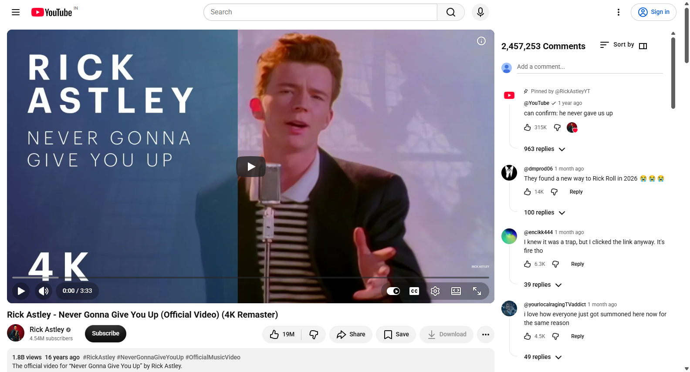
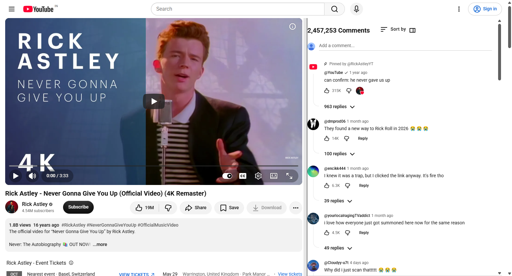
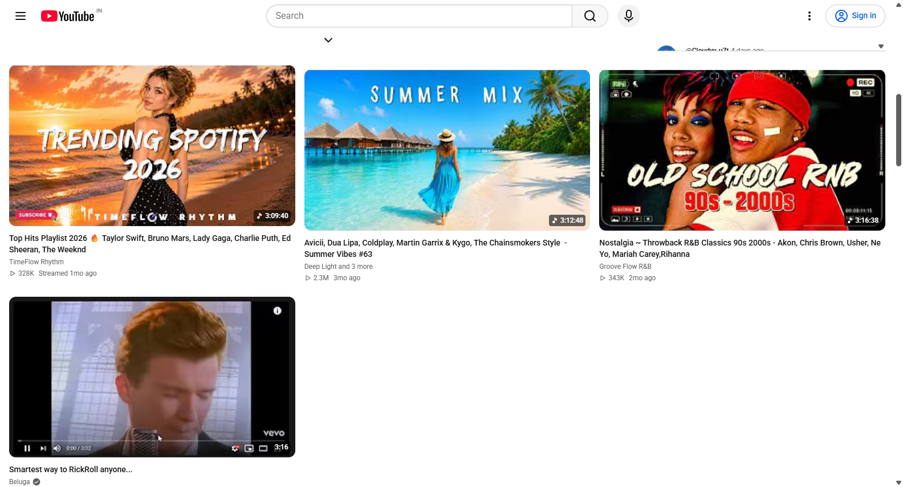
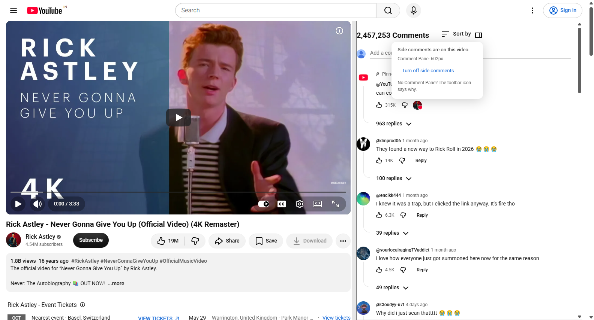
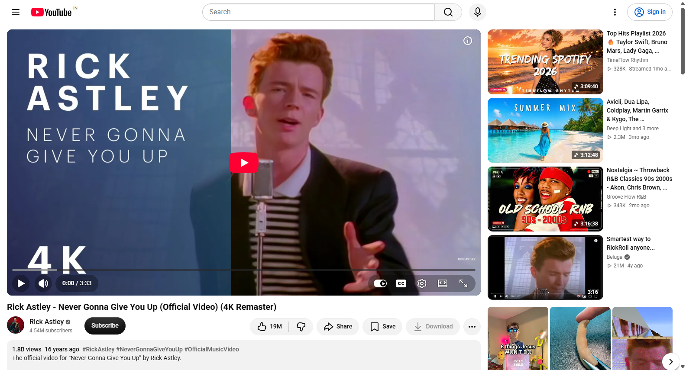

# YouTube Side Comments

Shows a YouTube video's comments in a pane beside the player, so you can watch and read at the same time.

YouTube puts the comments below the video, so you scroll down to read them and the video scrolls away. This moves them into a resizable column on the right — the space the recommendations were wasting — and drops the recommendations into a full-width grid underneath.



---

## What it does

**Comments beside the video.** Comments move into a column on the right, with their own scrollbar. Reading the thread never moves the video. These are YouTube's own comments, not a rebuild — sorting, replies, likes and the comment box all work exactly as they did.

**A draggable divider.** Drag the boundary to give either side more room.



**Recommendations moved below.** They leave the right rail and become a full-width grid of tiles, sized for the width they now have.



**A status control in the comments header.** A small icon next to "Sort by" tells you what the extension is doing and turns it off in one click.



**And it gets out of the way.** On pages where this layout doesn't fit, it leaves YouTube completely alone rather than half-applying something.



---

## Install

Chrome, or any Chromium browser (Edge, Brave, Arc). Not tested on Firefox. This is not on the Chrome Web Store — you load it from the folder.

1. Download or clone this repo. Note where the folder is.
2. Open `chrome://extensions` in your browser.
3. Turn on **Developer mode** — the toggle in the top right.
4. Click **Load unpacked**.
5. Select **the folder containing `manifest.json`** — the repo folder itself, not any file inside it.
6. Open any YouTube video.

When you first install it, Chrome hides new extensions. Click the **puzzle-piece icon** next to the address bar, find *YouTube Side Comments*, and click the **pin** to keep it visible.

---

## Using it

| | |
|---|---|
| **Resize** | Drag the divider between the video and the comments |
| **Fine-tune** | Click the divider, then use the **arrow keys** |
| **Reset the width** | **Double-click** the divider |
| **Turn it off / on** | The small icon next to **"Sort by"**, in the comments header |
| **Check what it's doing** | Click that same icon — or the toolbar icon, which works even when there's no comments pane to click |

Your width is remembered across videos and browser restarts.

### Why is there no comments pane on this page?

The extension deliberately does nothing on pages where this layout would cause trouble, and says so rather than failing quietly. It steps aside for:

- **Theater mode** and **fullscreen** — the player takes the whole window
- **Shorts** — a different page entirely
- **Live streams** — YouTube's live chat belongs in that column
- **Videos with comments turned off**
- **YouTube's own transcript or chapters panel**, while it's open
- **Narrow windows**, or when YouTube itself has collapsed to a single column

To find out which one applies, click the toolbar icon — it names the reason.

> **The most common cause of "it stopped working" is that it got switched off.** The off switch is global and persists, so if you turned it off once, every video afterwards has no pane. Click the toolbar icon; if it offers to turn the layout back on, that's what happened.

---

## Requirements and limits

- **Chrome / Chromium only.** WebExtensions for Firefox would need work.
- **Desktop `youtube.com` only.** Not the mobile site, not embeds, not YouTube Music.
- **Needs a reasonably wide window.** Below roughly 1000px, YouTube itself switches to one column and there's no room for a side pane — the extension steps aside and lets YouTube do its thing.
- **It may break when YouTube changes its page.** This kind of extension always does; YouTube's markup is not an API. When something stops working, the toolbar icon is the first place to look.

Nothing is sent anywhere. No analytics, no network requests, no accounts — the only thing stored is your pane width and whether the layout is on, both kept locally by your browser.

---

## Development

Plain JavaScript, no build step, no bundler, no dependencies. The source in `src/` is what runs.

```
npm test                  # everything — needs Chrome and a network
npm test -- test/engine.test.js   # just the pure engine, instant
YSC_SKIP_SMOKE=1 npm test # skip the browser tests, for offline work
```

The tests come in two layers, matching how the code is built:

- **`test/engine.test.js`** exercises the Layout Engine — a pure function that takes a description of the page and returns a decision. Every rule about where things go and when to back off lives here, and is enumerable in tests rather than only observable in a browser.
- **The browser tests** (`test/smoke.test.js`, `test/entry-navigation.test.js`) drive the real extension in real Chrome against real YouTube, since that is the only way to catch YouTube moving something. They need a network and take a few minutes.

`tools/screenshots.mjs` regenerates the images in this README from a live browser.

The design record — the spec and the tickets, including the bugs found along the way and the reasoning behind each decision — is in `.scratch/comment-pane/`. Start with `spec.md`.
